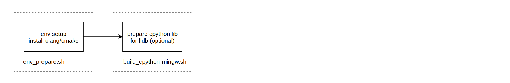
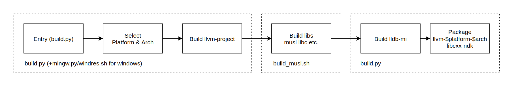

## Overview

This readme briefly describes the functionality of our LLVM toolchain and how to build it

1. [Build WIKI](#build_wiki)
2. [Function Introduction](#function_introduction)

<a name="build_wiki"></a>
## Build WIKI
</br>

### System Requirements for Toolchain BUild

Ubuntu >= 16.04  
MacOS X >= 10.15.4  

</br>

### Get Code
```
repo init -u https://gitee.com/OpenHarmony/manifest.git -b master -m llvm-toolchain.xml
repo sync -c 
repo forall -c 'git lfs pull'
```
</br>

### Toolchain build process

Here is an example of starting build process on Linux or MacOS:
```
# update prebuilts, no need to run each time
./toolchain/llvm-project/llvm-build/env_prepare.sh
# build
python3 ./toolchain/llvm-project/llvm-build/build.py
```

1. env_prepare (one time only)


2. build


</br>

### Options

build.py options：

```
--skip-build			# skip compile and goto package step
--skip-package			# do compile without package step
--enable-assertions		# enable assertion when compiling
--build-name 			# specify release package name
--debug					# build debug version llvm toolchain
--no-build-arm			# skip triplet arm
--no-build-aarch64  	# skip triplet arm64
--no-build-x86_64 		# skip triplet x86_64
--no-lto  				# disable LTO optimization when build toolchain
--build-instrumented	# enable instrument pgo when build toolchain
--xunit-xml-output 		# specify LLVM unit test XML report path
--no-build              # optional, skip some targets
    windows
    libs
    lldb-mi
    lldb-server
    linux 
    check-api
```
</br>

### Output Layout

When build successfully completed. following artifacts will be available in `out` directory

`sysroot` -> sysroots for OHOS targets  
`install` -> toolchain build  
`*.tar.bz2` -> archived versions of toolchain and sysroots  
</br>

### OHOS Archive

1. llvm
```
contains: 
1. toolchain which provides clang compiler, lldb(-mi), clang-tidy etc. tools
2. libc++/clang_rt/asan/fuzzer libs for target device

OHOS sync from: https://mirrors.huaweicloud.com/openharmony/compiler/clang/
Which is the same as: out/clang-dev-${platform}-${arch}.tar.bz2
OHOS archive to: prebuilts/clang/ohos//${platform}/llvm

License: Apache License v2.0 with LLVM Exceptions
```

2. libcxx-ndk
```
contains: provide libc++ for ndk in target device

OHOS fetch prebuilts from: https://mirrors.huaweicloud.com/openharmony/compiler/clang/ and archive it to prebuilts/clang/ohos//${platform}/libcxx-ndk. This tar is 

License: Apache License v2.0 with LLVM Exceptions
```

<a name="function_introduction"></a>
## Function Introduction
</br>

### Functionality

The LLVM toolchain is built based on LLVM 12.0.1. It is used to provide capability of building ohos image. For detailed information about LLVM 12.0.1, please refer to [LLVM 12.0.1](https://lists.llvm.org/pipermail/llvm-announce/2021-July/000093.html).
</br>

### Specifically Included Triplets

Despite all the components provided by LLVM community, we included several triplets for different types of ohos devices to our LLVM toochain, listed as below. For specification, liteos is a newly included OS name which indicate the simplified linux kernel.

| Triplet Name           | Architecture | System Kernel | System          |
| ---------------------- | ------------ | ------------- | --------------- |
| arm-liteos-ohos        | ARM 32bits   | LiteOS        | Small system    |
| arm-linux-ohos         | ARM 32bits   | Linux         | Small system    |
| arm-linux-ohos         | ARM 32bits   | Linux         | Standard system |
| aarch64-linux-ohos     | ARM 64bits   | Linux         | Standard system |

For detailed definition of Small System and Standard System, please refer to [System Types](https://gitee.com/openharmony/docs/blob/master/en/device-dev/Readme-EN.md).

