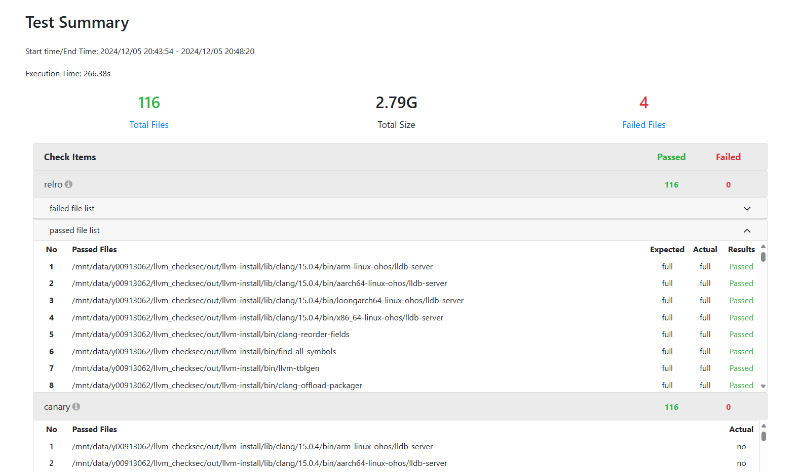

## Overview
This Readme Briefly describes the usage of run_checksec.sh to check security compilation options for binary build artifacts.

## Usage

Before using this script, you may need to clone the [checksec](https://github.com/slimm609/checksec) repository to the current directory (`llvm-build/checksec`) yourself. And If you previously executed run_checksec.sh and report the error `Need to look up README to use the script`, you should take the same actions.

Then the directory structure should be as follows:
```txt
checksec (The current directory.)
├── check.py  
├── checksec (the checksec repository you cloned)
│   ├── checksec (the checksec scrpt to exec in open-source checksec repository)
│   ├── ...
├── llvmsec-log 
│   ├── ...
├── README.md
├── run_checksec.sh (* use it to check our binary build artifacts)
└── templates
    ├── ...
```

Now run `run_checksec.sh` to check security compilation options for binary build artifacts.

Use '-h/--help' to print the usage of 'run_checksec.sh':

```shell
$ ./run_checksec.sh -h
Usage: ./run_checksec.sh [-s][-c check_dir] [-o ./llvmts-log/checksec] [OPTION]

Options are:
  -c/--check_dir <check_dir>       check_dir: Path to the binary file that you want to check using checksec.
  -o/--output_path  <output_path>  output_path: Path to store the results of the binary security compilation option checks.
  -h/--help                        print usage of run_checksec.sh
```

You can set the check directory using '-c/--check_dir' option and set the report output directory using '-o/--output_path' option:

`./run_checksec.sh -c=~/llvm_checksec/out/llvm-install/bin -o llvmts-log/checksec`

default running : `./run_checksec.sh`

This will default to checking the binary compilation products under `llvm_build/../../../out/llvm-install` and output the report in `llvm-build/checksec/llvmsec-log/`.

Finally, a visual HTML report like this will be generated through templates:


